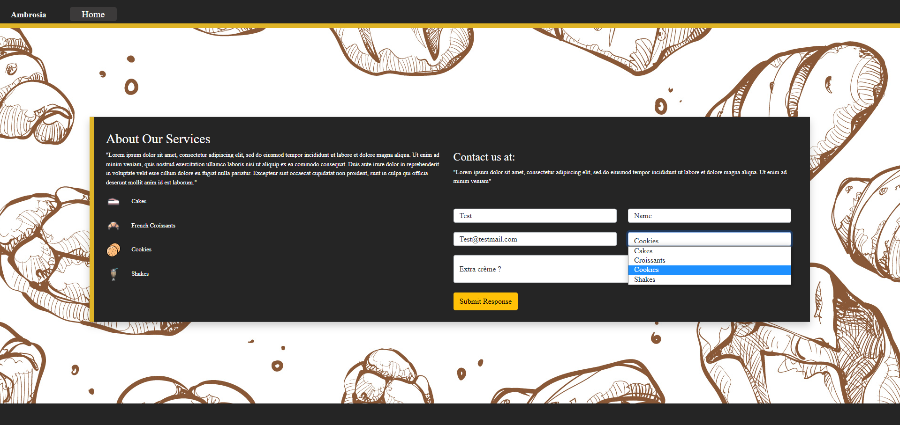
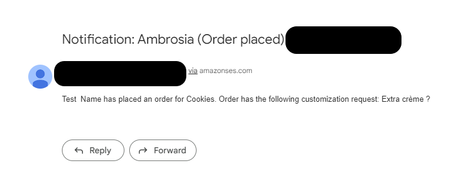
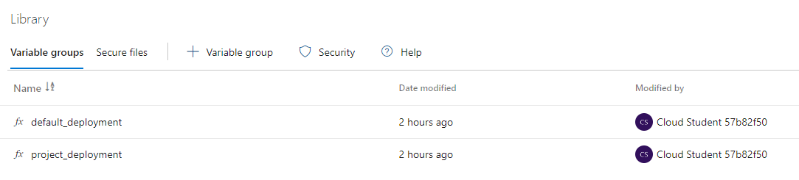
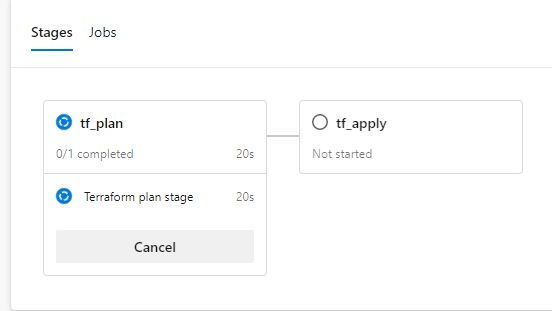

# **Ambrosia**: Project Documentation

## 1. **Scope**
### a. Project outline:
-    This project is intended to demonstrate the orchestration of a serverless and highly available environment developed on AWS via Terraform. Deployment through Azure DevOps Pipeline ensures CICD is maintained. 
 -   The objective is to design a website that can host a contact form. The client responses to said contact form must be preserved and the administrative team must be notified upon any new responses recorded. 

### b. Project architecture:
	The project architecture to be deployed on AWS is described in the image 1.
<figcaption align = "left"><b>Image 1 : <i>AWS  Architecture Diagram</i> </b></figcaption>
 

### c. Tools used for development:
- **AWS** : API Gateway, CloudFront, Cloudwatch dashboards, Cloudwatch logs DynamoDB, Lambda, S3, SES, WAF. 
- **Azure DevOps**: Environment, Pipeline, replace tokens task, Repository, Variable groups.
- **Developer tools & scripts**: git, Html/CSS, jQuery , Terraform.
&nbsp; 

## 2. **Core Components** 
    This section describes the terraform code and the architecture it supports.
### a. Website: 
-    The website required for this project does not possess any major dynamic components thus making s3 static website hosting the natural choice.
-    Cloudfront is used for both providing caching, as well as security in terms of SSL termination and geo restriction. Geo restriction can be toggled using geo_restriction_whitelist variable present within terraform.
-    Cloudfront will generate access logs stored within the logging bucket. Furthermore, the name of index document for the website as well as acl privacy status for s3 buckets can be altered. 
-    Present within : website.tf.
<figcaption align = "left"><b>Image 2 : <i>Website</i> </b></figcaption>

&nbsp; 

### b. Backend: 
- The backend consists of a synchronously called lambda function, code for which is generated at runtime with appropriate target resource names. 
- SES source & destination email ids are passed as secrets from Azure DevOps Variable groups at runtime. 
- DynamoDB is created by default in provisioned billing mode with 10 RCUs and WCUs each. This however can be changed by mapping the dynamodb_billing_mode to pay per request mode which then allows dynamodb to scale up according to the traffic received. 
- Present within : backend.tf.
<figcaption align = "left"><b>Image 3 : <i>SES Notification</i> </b></figcaption>

&nbsp; 

### c. Security: 
- WAF is used on both Cloudfront and API gateway, as a way to perform ip filtering and rate limiting to prevent unauthorized access and DDoS protection. Unauthorized users will receive 403 errors.
- You can whitelist your ip by adding appropriate values to the ip variable.
- Present within : security.tf.
- **Note** : Unless api_gateway_web_acl and api_gateway_web_acl_association resources within security.tf are moved to backend.tf, the following error will occur during preliminary terraform apply operation: Error creating WAFv2 WebACL: WAFInvalidParameterException. The error is resolved by redeploying the api_gateway_web_acl_association resource.

### d. Monitoring: 
- Cloudwatch dashboards keep track of number of requests, errors, latency and other critical metrics for each of the above-mentioned architectural components.
- Present within: monitoring.tf.

## 3. **CICD deployment**
    This section describes the Azure DevOps deployment.
### a. Azure DevOps Repository:
- Azure DevOps hosts its managed git repository to provide version control as well as integration to other Azure DevOps functionalities. 

### b. Azure DevOps Pipeline:
- Azure DevOps Pipeline is defined within a YAML file. There are two pipelines within the project, one for creating resources and other for destroying them. 

<figcaption align = "left"><b>Image 4 : <i>Azure DevOps Pipelines</i></b></figcaption>

&nbsp; 

- Azure pipeline YAML was written to streamline the deployment procedure. When the pipeline is to be deployed, it will present options naming the deployments currently available. These separate deployments can share a state file and operate independently from each other.

<figcaption align = "left"><b>Image 5 : <i>Deployment choices</i></b></figcaption>

&nbsp; 

- Azure pipelines can rely on predefined or marketplace tasks to perform certain actions. In this project we use a marketplace task called replace tokens and we also reference command line script templates written specifically for this deployment. 

<figcaption align = "left"><b>Image 6 : <i>Pipeline tasks</i></b></figcaption>

&nbsp; 

- For the purposes of debugging, each step taken by the Azure DevOps pipeline can have its log preserved for 30 days by default. Taking terraform as a reference these logs can describe the Terraform plan. 

<figcaption align = "left"><b>Image 7 : <i>Pipeline logs</i></b></figcaption>

&nbsp; 

### c. Azure DevOps Variable groups & replace tokens:
- Variable groups allow us to define variables to be passed to the pipeline at runtime. Variable groups can be created for the same pipeline but different environments, eg. prod, dev, QA. They can also store and pass secrets. 

<figcaption align = "left"><b>Image 8 : <i>Variable groups</i></b></figcaption>

&nbsp; 

- Replace tokens task allows variables from variable groups to be passed into the Terraform code, thus allowing us to pass sensitive variables such as passwords within the Terraform code as secrets. 

<figcaption align = "left"><b>Image 9 : <i>Replace Tokens</i></b></figcaption>

&nbsp; 

### d. Azure DevOps Environments:
- Within the scope of this project, we use Azure DevOps environments to create a stage approval. 
- Azure DevOps Pipeline for the project, was divided into two logically separated stages as shown in image 10.

<figcaption align = "left"><b>Image 10 : <i>Pipeline stages</i></b></figcaption>

&nbsp; 

- While progressing from one stage to another, for eg. from tf_plan to tf_apply, an approval requirement has been added so that the pipeline is restricted to only the planning stage and cannot deploy or destroy any resources. 

<figcaption align = "left"><b>Image 11 : <i>Stage approval</i></b></figcaption>

&nbsp; 